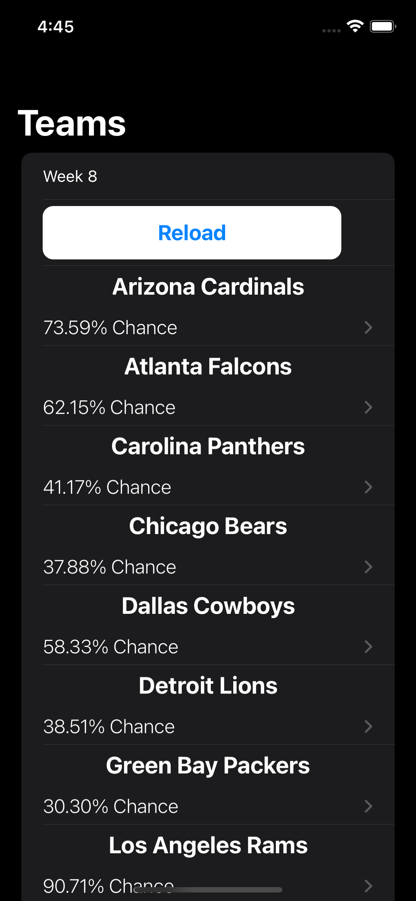
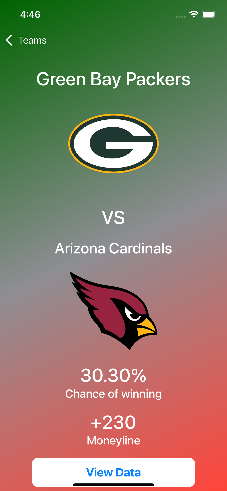
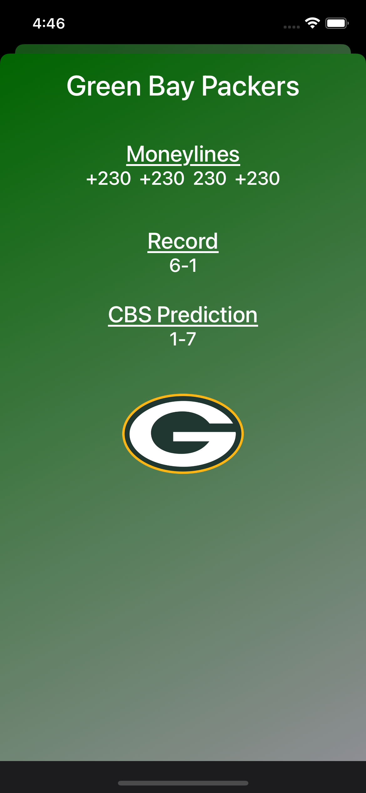

# Football Predictor
The frontend for the FootballPredictor project

## Images

#### The main app screen

#### An example of a selected team

#### An example of a team's data screen

## How it works
When the app loads, it makes a request to the Heroku [server](https://github.com/CreepyChameleon/FootballPredictor-Server) hosting the data, which acts as a middleman to pull data from a MongoDB database. The database is populated with data scraped from several betting websites, specifically the moneylines for each team that week. Those moneylines are converted to a percent chance of winning which can be easily interpreted by a user.

The database is currently updated each week with a manual run of the [backend](https://github.com/CreepyChameleon/FootballPredictor-Backend), but this can be automated at a future point.

## Repository links:
- [FootballPredictor-Server](https://github.com/CreepyChameleon/FootballPredictor-Server)
	- The server that runs on Heroku that the frontend app pulls from
- [FootballPredictor-Backend](https://github.com/CreepyChameleon/FootballPredictor-Backend)
	- The backend code that manages adding data to/interacting with the database
